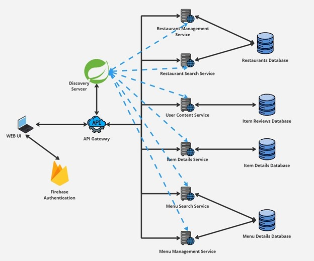
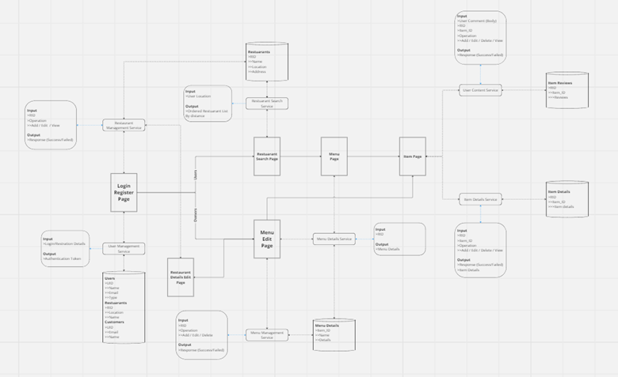

# EpicEats
EpicEats is envisioned as a cutting-edge platform that allows users to effortlessly locate restaurants, explore diverse menus, and share their culinary experiences through photos and reviews. This application will be designed following a microservices architecture to ensure scalability, flexibility, and a seamless user experience.  

https://miro.com/app/board/uXjVKDcaBP8=/

# Epic Eats: Restaurant Management System Based on Microservices

## Introduction
The Restaurant Management Microservices Project is an advanced process to manage a restaurant business through a network of different microservices. The major services include:
- Auth service for log-in
- Restaurant location service for creating, storing, and retrieving restaurant details
- Menu management service for handling restaurant menus
- User content service for user-generated content
- Reservation management service for booking tables

The implementation of utility and authentication services maintains security and enhances the overall management experience.

## Architecture

### Architecture Diagram

### Architecture Diagram in More Detail



### Design Decisions
This architecture follows the microservices pattern, offering scalability, maintainability, and ease of deployment. Below are the design decisions for partitioning the application into different services and their contributions:

- **API Gateway**
  - **Role:** Acts as a single-entry point for all client requests, providing load balancing, authentication, logging, and rate limiting.
  - **Contribution:** Simplifies client interactions and enhances security.

- **Discovery Server**
  - **Role:** Enables service discovery and registration using Spring Cloud Netflix Eureka.
  - **Contribution:** Facilitates dynamic service registration and discovery, ensuring services can find each other without hardcoding locations.

- **Menu Management Service**
  - **Role:** Handles menu operations such as creation, updating, and deletion.
  - **Contribution:** Maintains menu logic and updates without dependency on other services.

- **Menu Search Service**
  - **Role:** Provides search functionality for menu entries based on selected criteria.
  - **Contribution:** Enhances user experience with effective and meaningful menu searches.

- **Item Details Service**
  - **Role:** Maintains detailed information about each menu item, including ingredients, nutritional information, and price.
  - **Contribution:** Provides detailed menu item information, aiding in informed decision-making.

- **User Content Service**
  - **Role:** Manages user-generated content like reviews and ratings.
  - **Contribution:** Supports user engagement and feedback to improve service quality.

- **Restaurant Search Service**
  - **Role:** Enables users to search for restaurants based on location, cuisine, and other filters.
  - **Contribution:** Offers easy restaurant recommendations matching user preferences.

- **Restaurant Management Service**
  - **Role:** Manages restaurant data and operations, including adding new restaurants and updating details.
  - **Contribution:** Centralizes restaurant logic and operations, simplifying data management.

- **Databases**
  - **Role:** Stores data specific to each service, such as menu details and restaurant data.
  - **Contribution:** Ensures data consistency and performance, allowing each service to scale independently.

- **Firebase Authentication**
  - **Role:** Provides authentication services and user management.
  - **Contribution:** Secures system access, manages user authentication, and supports various authentication methods like email/password and social logins.

## Microservices

### Implementation Methods
The tech stack includes:
- Spring Firebase
- Java Spring Boot
- MySQL
- HTML
- Angular
- JavaScript
- TypeScript

Using Spring Cloud Gateway for API routing and Netflix Eureka for service discovery, the microservices are implemented.

### Core Services

#### Menu Management Service
- **Tech Stack:** Spring Boot, MySQL
- **Functionality:** Handles all menu operations.
- **REST API Endpoints:**
  - `GET /api/menus` - Retrieve menus
  - `POST /api/menus` - Create menus
  - `PUT /api/menus/{menuId}` - Update menus
  - `DELETE /api/menus/{id}` - Delete menus
  - `GET /api/menus/{menuId}/items` - Retrieve menu items
  - `POST /api/menus/{menuId}/items` - Create menu items
  - `PUT /api/menus/items/{Id}` - Update menu items
  - `DELETE /api/menus/items/{id}` - Delete menu items
  - `GET /api/menus/restaurants/{restaurantId}` - Retrieve menus by restaurant
  - `POST /api/menus/restaurants/{restaurantId}/menus` - Create menus by restaurant
  - `PUT /api/menus/restaurants/{restaurantId}/menus/{menuId}` - Update menus by restaurant
  - `DELETE /api/menus/restaurants/{restaurantId}/menus/{menuId}` - Delete menus by restaurant
- **Inter Service Interactions:** Interacts with menu search and restaurant services.

#### Menu Search Service
- **Tech Stack:** Spring Boot, MySQL
- **Functionality:** Provides efficient search capabilities across menu items.
- **REST API Endpoints:**
  - `GET /find/menus/search/restaurantId={restaurantId}&name={name}` - Retrieve menus by restaurant ID and name
  - `GET /find/menus/search/by-name-and-price?name={name}&price={price}` - Retrieve menu items by name and price
  - `GET /find/menus/search/by-price/price={price}` - Retrieve menu items by price
  - `GET /find/menus/search/by-name/name={name}` - Retrieve menu items by name
- **Inter Service Interactions:** Interacts with menu management service.

#### Item Details Service
- **Tech Stack:** Spring Boot,
- **Functionality:**The User Content Service manages and stores user-generated content, including reviews and photos, associated with users, restaurants, and menus.
- 
#### User Content Service
- **Tech Stack:** Spring Boot,
- **Functionality:**The User Content Service manages and stores user-generated content, including reviews and photos, associated with users, restaurants, and menus.
- **REST API Endpoints:**

    - POST/api/users		#Creating users
    - GET/api/users		#Retrieving users 
    - PUT/api/users/{user_id}	#Updating users by user id
    - DELETE/api/users/{user_id}	#Deleting users by user id
    - POST/api/restaurants		#creating restaurants
    - GET/api/restaurants		#retrive restaurants
    - PUT/api/restaurants/{restaurantsr_id}	#update restaurant by restaurant ids
    - DELETE/api/restaurants/{restaurants_id}	#delete restaurant by restaurant ids
    - POST/api/menus			#create menus
    - GET/api/menus			#get menu
    - PUT/api/menus/{menus_id}	#update menu details by menu id
    - DELETE/api/menus/{menus_id}	#delete menu by menu id
    - POST/api/reviews		#create reviews
    - GET/api/reviews			#retrieve reviews
    - PUT/api/reviews/{reviews_id}	#update reviews by id
    - DELETE/api/reviews/{reviews_id}	#delecte reviews by id
    - POST/api/photo			#create photos
    - GET/api/photo			#retrive photos
    - PUT/api/photo/{photo_id}	#update photo by photo id
    - DELETE/api/reviews/{photo_id}	#delete photo by photo id

**Inter Connection Service:** connect with menu management service to maintain menus


#### Restaurant Search Service

#### Restaurant Management Service

#### Discovery Server

#### API Gateway

### Interservice Communications
Interservice communications are done using Rest Templates. Example:

```java
ResponseEntity<Map> response = restTemplate.exchange(
    "http://restaurant-service/api/restaurants/{restaurantId}" + menu.getRestaurantId(), 
    HttpMethod.GET, 
    null, 
    Map.class
);
```

## User Interface

The user interface for the restaurant management system is implemented using React. This component-based framework allows for efficient and modular development, making it easy to manage and update various parts of the application. The implementation involves:

- Setting up a React project.
- Installing necessary dependencies like axios and react-router-dom.
- Creating reusable components.
- Managing state with React hooks.
- Integrating with backend services using axios.

## API Testing Tools

Postman is used to test, document, and monitor the restaurant management system APIs. Postman allows for:

- Building and sending HTTP requests.
- Managing multiple environments with variables.
- Grouping requests inside collections for better management.
- Writing test scripts that automate testing workflows.
- Simulating API responses with mock servers for testing purposes.

Steps include:

1. Setting up Postman.
2. Creating a new collection for the project.
3. Including requests for each of the API endpoints.
4. Setting up environments for different stages (development, staging, and production).
5. Writing test scripts to validate the responses.
6. Using Collection Runner to automate tests.
7. Reviewing results.

## Deployment

### Local Deployment

1. Clone the Repository:
   ```bash
   git clone https://github.com/SenuraLakshan/Plant-Growth-Monitoring-System.git
   ./mvnw spring-boot:run
   ```
2. Start the Eureka discovery server and API gateway.

# Development Challenges

During the development period, several challenges were faced, including:

- **Data Consistency:** Synchronization of the data transferring between the services to prevent data corruption, especially relationships between users, restaurants, menus, reviews, and photos.
- **Scalability:** Orienting the service to handle a large amount of user-generated content and high levels of traffic.
- **Security:** Ensuring the security of different user inputs and protecting against unwanted intruders.
- **Data Storage and Management:** Efficient storage and organization of large numbers of media files like photos, and enabling quick search capabilities.
- **Integration:** Ensuring a smooth interface with other microservices like the authentication service and menu management service.


